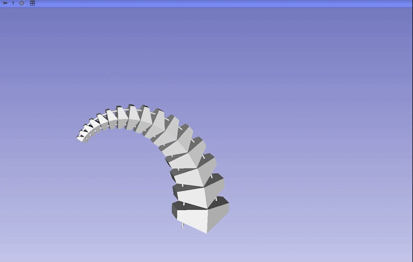
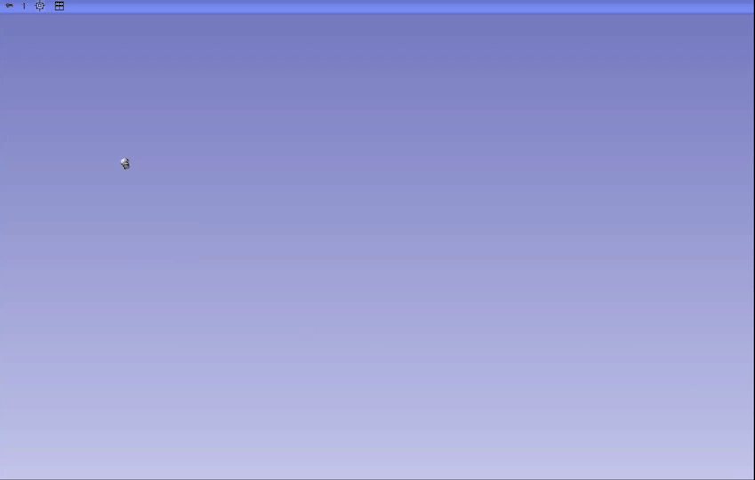
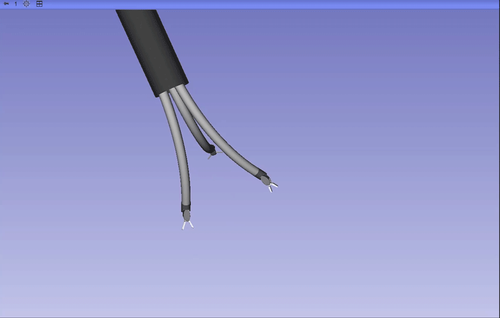
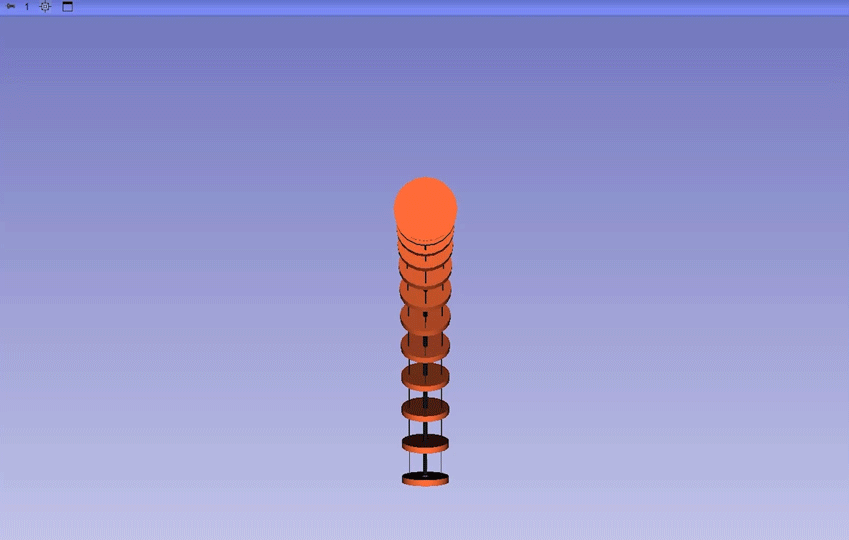

[](LICENSE)

# SlicerRobot

## Overview

SlicerRobo is a 3D Slicer module for visualizing and animating robotic systems within the medical imaging environment. It provides real-time rendering of both rigid-link and continuum robots by parsing URDF (Unified Robot Description Format) files and displaying them alongside medical imaging data.

## Demonstrations

Below are visual demonstrations of SlicerRoboViz capabilities:

### Robot Visualization Examples

<p align="center">
  
  
  
</p>

<p align="center">
  
  
  
</p>


## Features

### Multi-Robot Visualization
- **Load Multiple Robots**: Simultaneously visualize multiple robots in the same scene
- **Dynamic Robot Management**: Add or remove robots on the fly through an intuitive UI
- **Independent Control**: Each robot instance can be controlled independently

### URDF Support
- **Standard URDF Parsing**: Load conventional rigid-link robots defined in URDF format
- **Extended Continuum Support**: Parse custom URDF extensions for continuum/flexible robots
- **Mesh Rendering**: Support for STL and other mesh formats referenced in URDF files
- **Material Properties**: Render robots with colors and transparency defined in URDF

### Robot Motion & Animation
- **Joint State Updates**: Real-time update of revolute and prismatic joint positions
- **Continuum Segment Visualization**: Render flexible segments with waypoint-based trajectories
- **Transform Hierarchy**: Maintain and update complete kinematic chains
- **Smooth Animation**: Efficient updates for real-time robot motion visualization

### 3D Slicer Integration
- **Medical Image Overlay**: Visualize robots in the context of CT, MRI, and other medical images
- **Transform System**: Leverage 3D Slicer's transform nodes for robot kinematics
- **Parameter Nodes**: Store robot descriptions and states in Slicer's MRML scene
- **Interactive 3D Viewing**: Use Slicer's powerful 3D visualization capabilities

## Technical Architecture

### Core Components

1. **SlicerRoboViz**: Main module providing the Slicer widget interface and logic
2. **SlicerComm**: Communication module providing Serial, TCP/IP, and UDP communications


### Dependencies

This module utilizes the **urdf_parser_py** library developed by the ROS (Robot Operating System) community:

- **Repository**: [https://github.com/ros/urdf_parser_py](https://github.com/ros/urdf_parser_py)
- **Integration**: Embedded in `Dependencies/urdf_parser_py/` with extensions for continuum robots

#### Acknowledgment

We gratefully acknowledge the ROS community and the contributors to the `urdf_parser_py` project. The library provides the foundation for URDF parsing in this module. We have extended it to support custom continuum robot descriptions while maintaining compatibility with standard URDF formats.

## Installation

1. Install [3D Slicer](https://download.slicer.org/) (version 5.0 or later recommended)
2. Clone or download this repository
3. In 3D Slicer, go to: `Edit` → `Application Settings` → `Modules` → `Additional module paths`
4. Add the path to the `SlicerRobot` directory
5. Restart 3D Slicer
6. Find "SlicerRoboViz" under the "SlicerRobot" category in the module selector

## Usage

### Loading a Robot

1. Open the SlicerRoboViz module in 3D Slicer
2. In the first robot panel, click the folder icon to browse for a URDF file
3. Click **"Load Robot"** to visualize the robot
4. The robot will appear in the 3D view with its initial configuration

### Adding Multiple Robots

1. Click **"Add New Robot"** to create additional robot panels
2. Each panel can load a different robot independently
3. Remove robots using the **"Remove Robot"** button in each panel

### Updating Robot State

Use the module's logic interface programmatically to update robot configurations:

```python
import slicer
from SlicerRoboViz import SlicerRoboVizLogic

# Get the logic instance
logic = slicer.modules.SlicerRoboVizWidget.logic

# Update joint positions (for rigid-link robots)
robot_name = "your_robot_name"
joint_positions = [0.1, 0.2, 0.3, ...]  # radians or meters
success, exec_time = logic.updateRobotState(robot_name, joint_positions=joint_positions)

# Update continuum segments (for flexible robots)
backbone_waypoints = np.array([...])  # Shape: (num_segments, num_waypoints, 3)
segment_transforms = np.array([...])  # Shape: (num_segments, 4, 4)
success, exec_time = logic.updateRobotState(robot_name, 
                                           backbone_waypoints=backbone_waypoints,
                                           segment_end_transforms=segment_transforms)
```

## URDF Extensions for Continuum Robots

SlicerRoboViz extends standard URDF to support continuum robots with the following custom tags:

```xml
<segment name="segment_name" parent="parent_link">
  <origin xyz="0 0 0" rpy="0 0 0"/>
  <continuum_body initial_length="0.1">
    <continuum_unit offset="0.01" angle="0.0"/>
    <!-- Additional continuum units -->
  </continuum_body>
  <disks count="10" span="0.0 1.0">
    <geometry type="mesh" filename="path/to/disk.stl"/>
    <color rgba="1.0 0.0 0.0 1.0"/>
  </disks>
</segment>
```

## API Reference

### SlicerRoboVizLogic Methods

- `loadRobot(urdf_file_path, robot_number)`: Load a robot from URDF file
- `updateRobotState(robot_name, joint_positions, backbone_waypoints, segment_end_transforms)`: Update robot configuration
- `getRobotClass(robot_name)`: Get the URDF robot object
- `getSegmentGlobalWaypoints(robot_name)`: Get continuum segment waypoints in world coordinates
- `getTransformsHierarchy(robot_name)`: Get the complete transform tree
- `RemoveRobot(robot_number)`: Remove a specific robot from the scene
- `RemoveAllRobots()`: Clear all robots from the scene

## Developer Information

**Author**: Letian Ai  
**Organization**: BM2 Lab, Georgia Institute of Technology  
  
## TODO
Add use templates

## Contributing

Contributions are welcome! 

## License
BSD-3-Clause License

## References

1. ROS URDF Parser: [https://github.com/ros/urdf_parser_py](https://github.com/ros/urdf_parser_py)
2. URDF Specification: [http://wiki.ros.org/urdf/XML](http://wiki.ros.org/urdf/XML)
3. 3D Slicer: [https://www.slicer.org/](https://www.slicer.org/)

## Support

For issues, questions, or feature requests, please contact the BM2 Lab or open an issue in the repository.